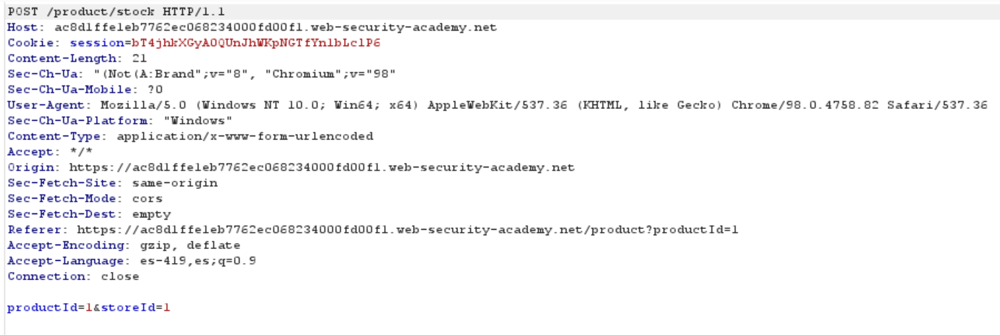
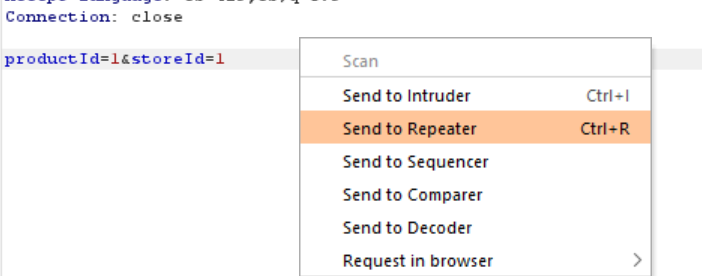

# OS Command Injection Lab 01
#### __ __m4dh4tt3r__ __
---

## What is OS command injection ?

OS command injection (also known as shell injection) is a web security vulnerability that allows an attacker to execute arbitrary operating system (OS) commands on the server that is running an application, and typically fully compromise the application and all its data. Very often, an attacker can leverage an OS command injection vulnerability to compromise other parts of the hosting infrastructure, exploiting trust relationships to pivot the attack to other systems within the organization.

## How to prevent OS command injection attacks

 By far the most effective way to prevent OS command injection vulnerabilities is to never call out to OS commands from application-layer code. In virtually every case, there are alternate ways of implementing the required functionality using safer platform APIs.

If it is considered unavoidable to call out to OS commands with user-supplied input, then strong input validation must be performed. Some examples of effective validation include:

- Validating against a whitelist of permitted values.
- Validating that the input is a number.
- Validating that the input contains only alphanumeric characters, no other syntax or whitespace.

Never attempt to sanitize input by escaping shell metacharacters. In practice, this is just too error-prone 

## Resolving the lab

First open your Burp Suite Tool

Now open your account in the section OS Command Injection

Start your lab "Access de lab"

Then you will se some like this one

Now the lab say :

This lab contains an *__OS command injection__* vulnerability in the product stock checker.

The application executes a shell command containing user-supplied product and store IDs, and returns the raw output from the command in its response.

To solve the lab, execute the whoami command to determine the name of the current user.

Then with Burp Suite wee ned search this vunlnerability, enable your intercept on

So now visit any article into the page, I'm gonna to the flying Doggy

We see exist list option where we can choose or select the country, perfect with the inpercept one choose any country and press '__check stock__'

Burp show us the following response, the most import is the line __productId=1&storeId=1__ because here is where we can abuse of this vulnerability.

okay, noy right click and press __Send to Repeater__

On the tab __Repeater__ we can se the reques over the web

Here we can play with the reques to try find the __os command injection__

Fist we need to add the following code beside te parameter __productId=1__ , __productId=1|whoami__ and press __Send__

we can see the response and heeey perfect it is working 

And the lab is completed

